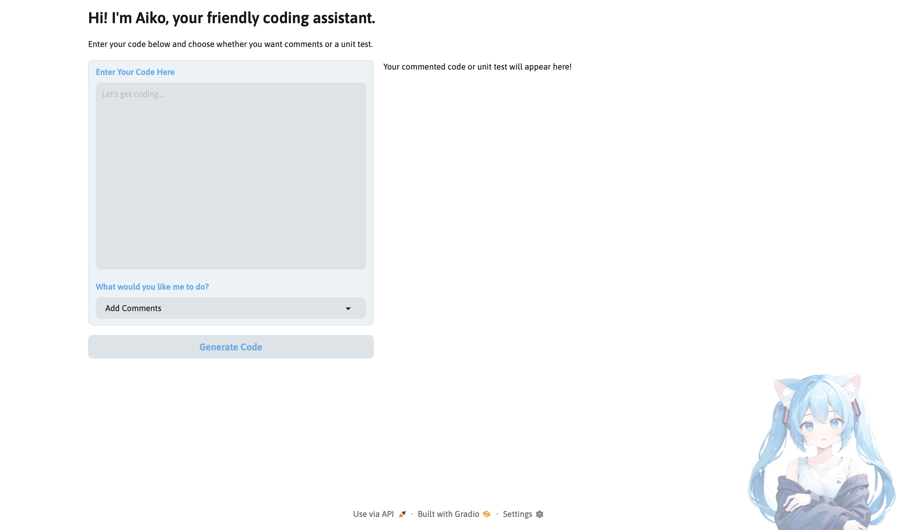
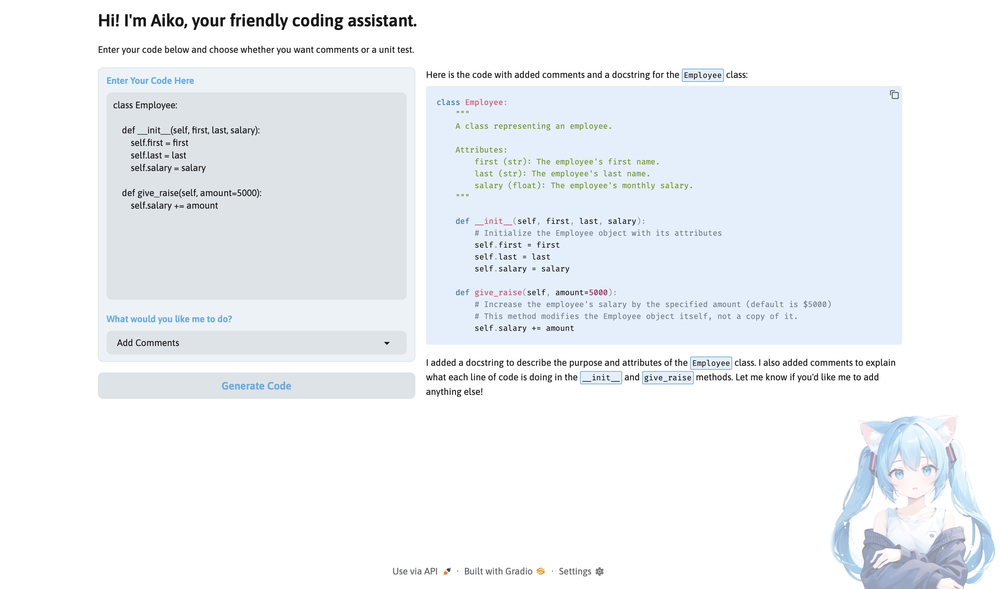
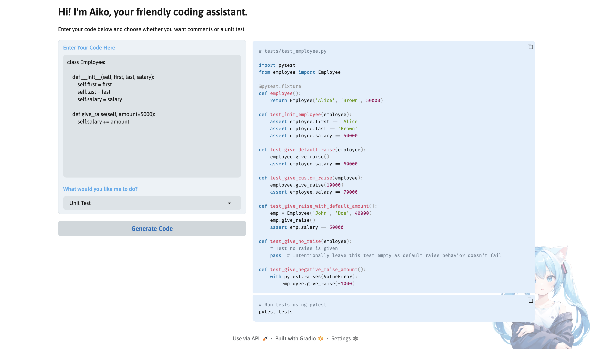

# AikoCode

This repository contains AikoCode, an AI-powered coding assistant built with Python, Ollama, and Gradio. Users can input code in any programming language, and AikoCode will automatically add comments and docstrings or generate executable unit tests. The project demonstrates LLM integration, code analysis, unit test generation, and an interactive web interface for coding assistance.  

## Screenshots


*Input code, choose action (Add Comments / Unit Test), and view output.* 

## Demo

### 1. Add Comments
**Prompt:**
> Enter your code and select "Add Comments".

**Result:**

*Adds descriptive docstrings and inline comments for readability and documentation.*

### 2. Unit Test
**Prompt:**
> Enter your code and select "Unit Test".

**Result:**

*Automatically generates executable unit tests based on user code.*    

## Project Overview

- **Genre:** Coding Assistant / Developer Tool  
- **Framework:** Gradio + Ollama
- **Objective:** Help users comment code and generate unit tests across multiple languages  
- **Visuals:** Clean, minimal web interface with responsive layout  
- **Audio:** None (text-based assistant)  
- **Features:** LLM-powered code analysis, commenting, unit test generation, interactive web interface  

## Features

- **Code Commenting:** Adds detailed docstrings and inline comments for any programming language  
- **Unit Test Generation:** Generates fully executable unit tests in the appropriate language and framework  
- **Multi-language Support:** Detects language automatically and applies relevant commenting or testing conventions  
- **Interactive Web UI:** Gradio interface for easy input and output  
- **Secure Execution:** Only generates code; does not execute user code  
- **Dropdown Options:** Easily choose between “Add Comments” or “Unit Test”  

## Controls

- **Enter Code:** Type or paste code into the input box  
- **Select Action:** Choose either "Add Comments" or "Unit Test" from the dropdown  
- **Generate:** Click the "Generate Code" button to receive output  

## How AikoCode Works

### Code Processing Loop
- Accept user input via Gradio textbox
- Detect requested action: Add Comments or Unit Test
- Send code and system instructions to Ollama
- Stream response back to the interface
- Display fully-commented code or executable unit test

### Commenting Logic
- Adds docstrings and inline comments for all functions, classes, and methods
- Handles multiple programming languages
- If language is unknown, responds appropriately

### Unit Test Logic
- Generates tests that validate correct function behavior
- Includes default and custom argument testing
- Uses appropriate testing frameworks (pytest for Python, JUnit for Java, assert harness for C)
- Outputs ready-to-run code without explanations or placeholders
  
## Installation

1. **Clone the repository**  
```bash
git clone https://github.com/jordanmatsumoto/aikocode.git
```
2. **Change directory**
```bash
cd aikocode
```

3. **Install dependencies**
```bash
pip install -r requirements.txt
```

4. **Run the app**
```bash
python aikocode.py
```

5. **Open the Gradio interface**  
A local URL and optional shareable URL will appear in the console.
